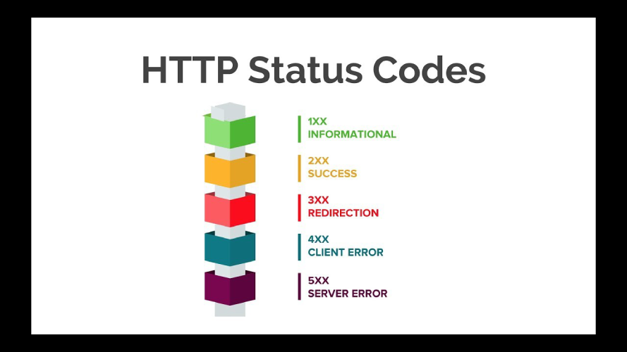
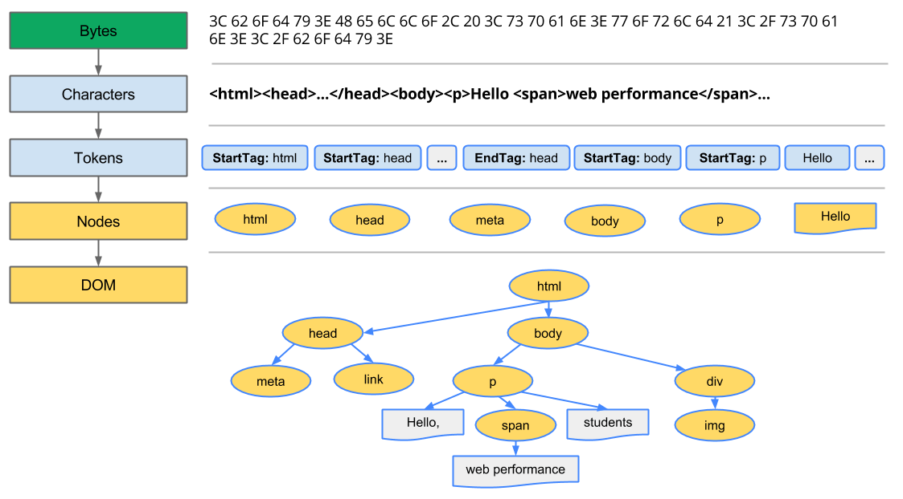
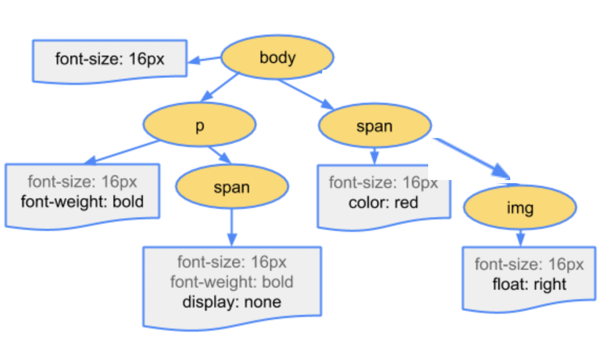

# 주소창에 URL 입력 시 일어나는 일

## 0. 개요

`주소창에 URL 입력 시 일어나는 일`은 기술 면접 단골 질문들 중 하나이다.

면접에서 간단하게 기술할 요약 버전과 조금 더 자세히 이해할 수 있는 자세한 버전으로 작성해보겠다.

## 1. 요약 버전

### 1. URL 입력

사용자가 웹 브라우저의 주소창에 URL을 입력합니다.

### 2. Cache 확인

Cache에 DNS 기록이 존재하는지 확인합니다.

### 3. DNS 조회

Cache에 없다면, 브라우저가 URL의 도메인을 호스팅하는 IP주소를 찾기 위해 DNS 서버를 조회합니다.

### 4. TCP 연결

브라우저가 해당 서버와 TCP 연결을 시작하고, 3-way handshake를 진행합니다.

### 5. HTTP 요청

브라우저가 해당 IP 주소의 서버로 HTTP 요청을 보냅니다.

### 6. 서버 응답

서버가 요청을 처리하고 HTML, CSS, JavaScript 파일 등 리소스를 응답합니다.

### 7. 브라우저 렌더링

1. **DOM 트리 생성**: 브라우저가 응답받은 HTML을 파싱하여 DOM(Document Object Model) 트리를 생성합니다.
2. **CSSOM 트리 생성**: CSS를 파싱하여 CSSOM (CSS Object Model) 트리를 생성하여 스타일 규칙을 적용하고, JavaScript를 실행합니다.
3. **Render 트리 생성**: DOM과 스타일 정보를 결합하여 Render Tree를 생성합니다.
4. **Layout 및 Paint**: 레이아웃을 계산한 후, 화면에 그려 사용자에게 표시합니다.

### 8. 완성

사용자가 페이지와 상호작용할 수 있게 됩니다.

## 2. 자세한 버전

### 1. URL 입력

사용자가 웹 브라우저의 주소창에 URL을 입력합니다.

### 2. Cache 확인

Cache에 DNS 기록이 존재하는지 확인합니다.

**DNS 란** : Domain Name System의 약자로, URL의 이름과 IP주소를 저장하고 있는 데이터베이스입니다.

브라우저는 먼저 로컬 DNS Cache를 확인하여 해당 도메인의 IP 주소가 저장되어 있는지 확인합니다.

로컬 Cache에 없으면, 운영 체제의 DNS Cache, 그리고 인터넷 서비스 제공자(ISP)의 DNS Cache를 순차적으로 확인합니다.

### 3. DNS 조회

Cache에 없다면, 브라우저가 URL의 도메인을 호스팅하는 IP 주소를 찾기 위해 DNS 서버를 조회합니다.

- DNS 서버에 DNS 조회 요청을 보냅니다.
- DNS 서버는 도메인 이름을 해당 IP 주소로 변환하여 응답합니다.

### 4. TCP 연결

브라우저가 해당 서버와 TCP 연결을 시작하고, 3-way handshake를 진행합니다.

**TCP/IP :** 현재의 인터넷에서 컴퓨터들이 서로 정보를 주고 받는데 쓰이는 통신규약 (프로토콜)의 모음으로, 총 4개의 계층으로 이루어져 있습니다.

**3-way handshake** : TCP/IP 프로토콜을 이용해서 통신하는 응용프로그램은 데이터를 주고받기 전, 먼저 연결을 진행합니다.

- 클라이언트가 서버에게 연결을 요청하는 **SYN** 패킷을 보냅니다.
- 서버는 **SYN-ACK** 패킷으로 응답합니다. SYN (synchronize : 연결 요청) 신호에 대한 ACK (acknowledgement : 승인) 신호를 전송합니다.
- 클라이언트가 다시 **ACK** 패킷을 보내며 연결이 완료됩니다.
- 이 3-way handshake 과정을 사용함으로써 연결의 신뢰성과 양방향 통신 채널을 보장합니다.

### 5. HTTP 요청

브라우저가 해당 IP 주소의 서버로 HTTP 요청을 보냅니다.

**HTTP 메서드**: GET, POST, PUT, DELETE 등

**HTTP 요청의 구조**:

- **요청 줄(Request Line)**: 메서드, 요청 URL, HTTP 버전이 포함됩니다.
- **헤더(Header)**: 요청에 대한 부가 정보를 포함합니다.
- **본문(Body)**: POST와 같은 메서드에서는 본문에 데이터를 포함할 수 있습니다.

### 6. 서버 응답

서버가 요청을 처리하고 HTML, CSS, JavaScript 파일 등 리소스를 응답합니다.

서버는 요청을 처리하여 적절한 응답을 브라우저에 반환합니다.

**HTTP 응답의 구조**:

- **상태 줄(Status Line)**: HTTP 버전, 상태 코드(예: 200 OK), 상태 메시지가 포함됩니다.
- **헤더(Header)**: 응답에 대한 부가 정보를 포함합니다.
- **본문(Body)**: 요청한 리소스(HTML, CSS, JavaScript 파일 등)가 포함됩니다.

### 7. 브라우저 렌더링

**7-1. DOM 트리 생성**

- 브라우저가 응답받은 HTML을 파싱하여 DOM(Document Object Model) 트리를 생성합니다.
- 이전 단계에서 통신을 통해 받아온 HTML 파일들은 바이트 형태로 전달됩니다.
- 바이트 → 문자 → 토큰 → 노드 → DOM 트리로 전환하는 작업을 수행합니다.
- 

**7-2. CSSOM 트리 생성**

- CSS를 파싱하여 CSSOM(CSS Object Model) 트리를 생성합니다.
- DOM 트리와 같은 방식으로 객체 모델로 전환합니다.
- CSS 규칙을 파싱하여 각 노드에 하향식으로 스타일을 적용합니다.
- 

**7-3. Render 트리 생성**

- DOM과 스타일 정보를 결합하여 Render Tree를 생성합니다.
- DOM 트리와 CSSOM 트리를 결합하여 각 요소가 화면에 어떻게 표시될 지를 결정합니다.
- 

**7-4. Layout 및 Paint**

- 레이아웃을 계산한 후, 화면에 그려 사용자에게 표시합니다.
- **레이아웃(Layout)**: 각 요소의 위치와 크기를 계산합니다.
- **페인팅(Painting)**: 요소를 화면에 그리는 과정입니다.
- **컴포지팅(Compositing)**: 여러 레이어를 합쳐 최종적으로 화면에 표시합니다.

### 8. 완성

사용자가 페이지와 상호작용할 수 있게 됩니다.

렌더링이 완료된 후, 사용자는 페이지와 상호작용할 수 있게 됩니다.

추가적인 사용자 동작이나 JavaScript 실행에 따라 DOM과 Render Tree가 다시 계산될 수 있습니다.
