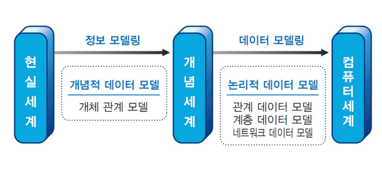

## 0. 핵심 키워드

### 논리 데이터 모델링

데이터베이스 설계 프로세스의 기초 설계 단계로, 비즈니스 정보의 구조와 규칙을 명확하게 표현할 수 있는 기법.

### 물리 데이터 모델링

관계 데이터 모델링으로도 불리며, 논리적 데이터 모델을 DBMS의 특성, 기능, 성능 등을 고려해 DB의 물리적인 구조를 작성해 나가는 기법.

### 정규화 (Normalization)

관계형 데이터 모델에서 데이터의 중복성을 제거해 이상 현상을 방지하고, 데이터의 일관성과 정확성을 유지하기 위해 무손실 분해하는 과정.

### 데이터 마이닝

대규모로 저장된 데이터 안에서 체계적이고 자동적으로 통계적 규칙이나 패턴을 찾아내는 기술.

## 1. 데이터 모델링

### 데이터 모델

현실 세계의 데이터를 인간과 컴퓨터가 이해할 수 있도록 추상화하여 표현한 모델. 데이터베이스의 구조와 제약 조건을 정의함.

### 데이터 모델 절차

1. 요구사항 분석
2. 개념적 데이터 모델
3. 논리적 데이터 모델
4. 물리적 데이터 모델

### 논리 데이터 모델링

데이터 모델이 요구사항을 충족시키는지를 검증하는 과정. 릴레이션 스키마, 함수적 종속성, 정규화 등의 논리 데이터 모델링에 대한 이해가 필요. 데이터 모델의 일관성, 중복 제거, 무결성 등을 확인.

### 논리적 데이터 모델 종류

- **관계 데이터 모델**: 테이블 형식
- **계층 데이터 모델**: 트리 형식
- **네트워크 데이터 모델**: 그래프, 망 형식

### 관계 대수

원하는 정보와 그 정보를 어떻게 유도하는가를 기술하는 절차적 정형 언어.

- 일반 집합 연산자: 합집합, 교집합, 차집합, 카티션 프로덕트
- 순수 관계 연산자: 셀렉트, 프로젝트, 조인, 디비전

### 관계 해석

튜플 관계 해석과 도메인 관계 해석을 하는 비절차적 언어.

### 정규화(Normalization)

데이터의 중복성을 제거해 이상 현상을 방지하고, 데이터의 일관성과 정확성을 유지하기 위해 무손실 분해하는 과정.

### 정규화 단계

1. **1NF**: 도메인이 원자값
2. **2NF**: 부분 함수 종속 제거
3. **3NF**: 이행 함수 종속 제거
4. **BCNF**: 결정자 함수이면서 후보키 아닌 것 제거
5. **4NF**: 다치 종속 제거
6. **5NF**: 조인 종속 제거

### 이상 현상(Anomaly)

데이터의 중복성으로 인해 릴레이션을 조작할 때 발생하는 비합리적인 현상.

- 삽입 이상, 삭제 이상, 갱신 이상

### 반 정규화(De-Normalization)

정규화된 엔티티, 속성, 관계에 대해 성능 향상과 개발 운영의 단순화를 위해 중복, 통합, 분리 등을 수행하는 과정.

## 2. 물리 데이터 저장소 설계

### 참조 무결성 제약 조건

참조하는 외래키의 값은 항상 참조되는 릴레이션에 기본키로 존재해야 함.

- 제한(RESTRICT), 연쇄(CASCADE), 널값(SET NULL)

### 파티션(Partition)의 종류

- **레인지(Range) 파티셔닝**: 연속적인 숫자나 날짜 기준
- **해시(Hash) 파티셔닝**: 파티션 키의 해시 함수 값
- **리스트(List) 파티셔닝**: 특정 파티션에 저장될 데이터에 대한 명시적 제어 가능
- **컴포지트(Composite) 파티셔닝**: 레인지, 해시, 리스트 중 2개 이상의 파티셔닝 결합
