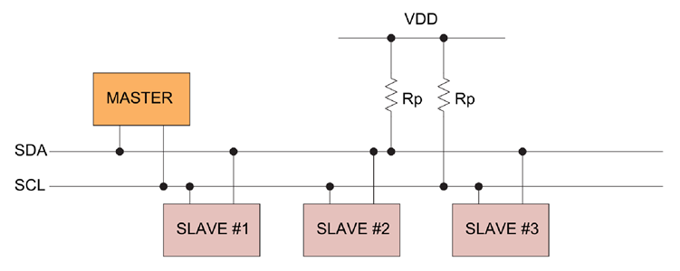
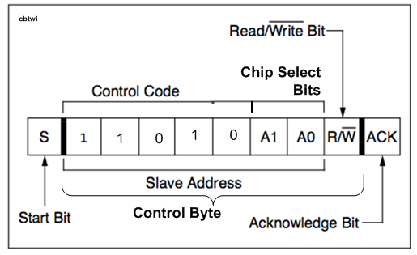
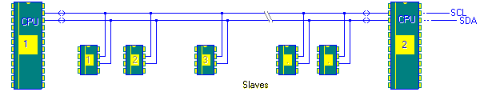
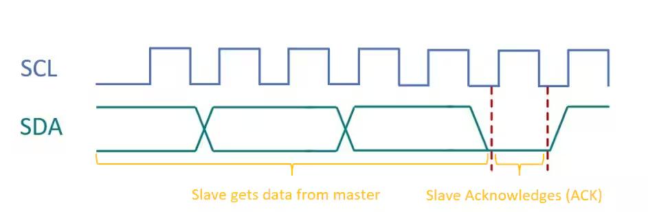
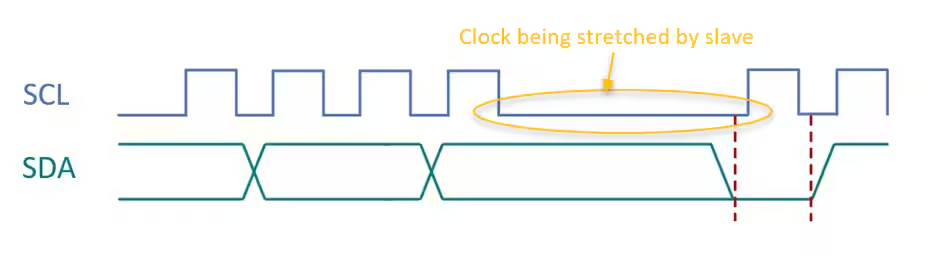
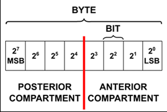

# I2C

- [I2C](#i2c)
  - [I2C(Inter-Integrated Circuit)](#i2cinter-integrated-circuit)
    - [SDA](#sda)
    - [SCL](#scl)
  - [I2C Modes](#i2c-modes)
    - [Sm : Standard-Mode](#sm--standard-mode)
    - [Fm : Fast-Mode](#fm--fast-mode)
    - [Fm+](#fm)
  - [I2C Protocol](#i2c-protocol)
  - [Reference](#reference)

## I2C(Inter-Integrated Circuit)
1982 Phillips Semiconductors에서 개발한 `직접 회로 간에 사용되는 2선 직렬 통신 시스템`이다.

`SDA`와 `SCL`선은 `저항으로 풀업`해야 하고, 저항값은 버스 길이와 전송 속도에 따라 달라진다. (일반적으로는 4.7kΩ)

### SDA
`Serial Data`는 마스터와 슬레이브가 정보를 보내거나 받는 선이다. (Sequence of Bits)

>H : 1, L : 0

### SCL
`Serial Clock`은 데이터 흐름 동기화를 위한 전용 클록 선이다.

>H : Data Stable, L : Data Change

## I2C Modes
I2C의 모드는 `비트 전송률`에 따라 세 가지로 나눌 수 있다.
### Sm : Standard-Mode
`최대 100kbit/s`의 비트 전송률
### Fm : Fast-Mode
`최대 400kbit/s`의 비트 전송률
### Fm+
`최대 1Mbit/s`의 비트 전송률

## I2C Protocol
| Acronyms | Mean                              | SDA   | SCL       | Feature                                       |
| -------- | --------------------------------- | ----- | --------- | --------------------------------------------- |
| `S`      | Start Bit / Condition             | H → L | H         | 데이터 전송 시작                              |
| `P`      | Stop Bit                          | L → H | H         | 데이터 전송 종료                              |
| `Sr`     | Repeated Start(Restart) Condition | H → L | H         | 종료 없이 새 전송 시작                        |
| `R `     | Read Bit                          | L     | L → H → L | 슬레이브에서 데이터 읽기 요청                 |
| `W\`     | Write Bit                         | L     | L → H → L | 슬레이브에 데이터 쓰기 요청                   |
| `A`      | Acknowledge (ACK)                 | L     | L → H → L | DATA BYTE 이후, 슬레이브가 데이터 수신 완료함 |
| `A\`     | Not Acknowledge (NACK)            | L     | L → H → L | DATA BYTE 이후, 슬레이브가 데이터 수신 실패함 |

- `Slave Address`: 슬레이브 장치의 고유 주소. 
  

- `Data Byte`: 전송되는 실제 데이터. 보통 8비트. (주소일 경우 7Bit 주소, 1Bit R/W\)

- `Bus Arbitration`: 여러 마스터가 버스를 사용할 때 충돌을 피하는 과정. 
   
  사진과 같이 Master MCU가 여러 개 있을 때, 두 마스터가 같은 슬레이브를 동시에 사용하려고 하면 충돌이 일어난다. 충돌을 피하기 위해 늦게 액세스한 마스터는 전송을 잠시 늦춘다(bus에 STOP이 있을 때 까지)

- `Clock Stretching`: 슬레이브가 처리 시간을 요구할 때 클럭 신호를 지연시키는 기능 
   
  ***[Expected Slave Clock Behavior with no Clock Stretching]*** 
   
  ***[Clock Stretching during hub suspend]***

---
|  | - `MSB (Most Significant Bit)` : 데이터 형의 최 상위 비트   **`(signed에서는 부호!)`**   - `LSB (Least Significant Bit)` : 데이터 형의 최하위 비트   >`MSB`부터 수신하는지, `LSB`부터 수신하는지 유의해서 프로그래밍하기! |
|------------------------|-------------------------------------------------------------------------------------------------------------------|

## Reference
- [STM32 - Getting started with I2C](https://wiki.st.com/stm32mcu/wiki/Getting_started_with_I2C#)
- [Analog Devices - I2C Primer: What is I2C? (Part 1)](https://www.analog.com/en/resources/technical-articles/i2c-primer-what-is-i2c-part-1.html)
- [Arduino FORUM](https://forum.arduino.cc/t/i2c-addressing-registers-and-bits/543946)
- [MICROCHIP - I2C Clock Stretching with Microchip USB Hubs](https://microchip.my.site.com/s/article/I2C-Clock-Stretching-with-Microchip-USB-Hubs)
- [esacademy - Bus Arbitration](https://www.esacademy.com/en/library/technical-articles-and-documents/miscellaneous/i2c-bus/general-introduction/bus-arbitration.html)
