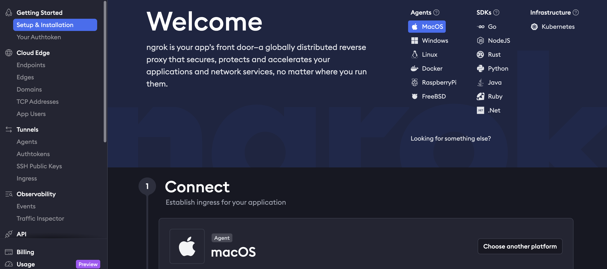
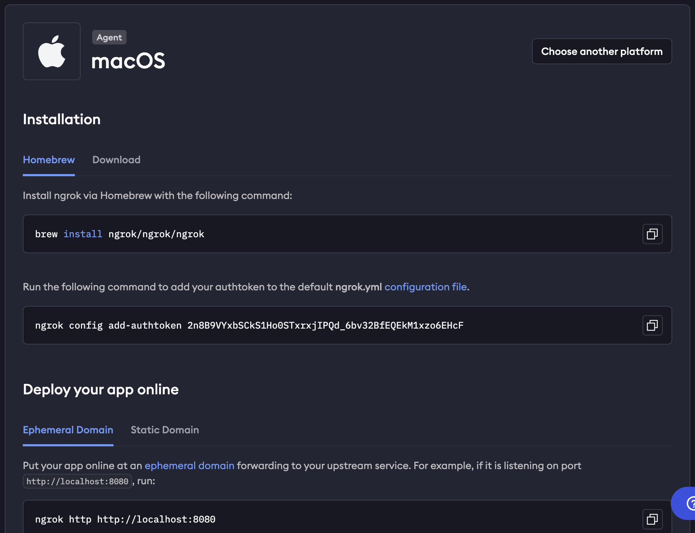
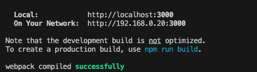
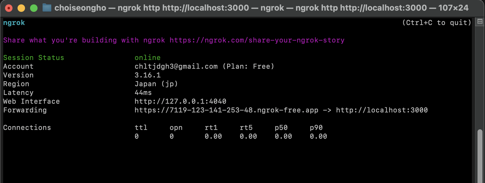
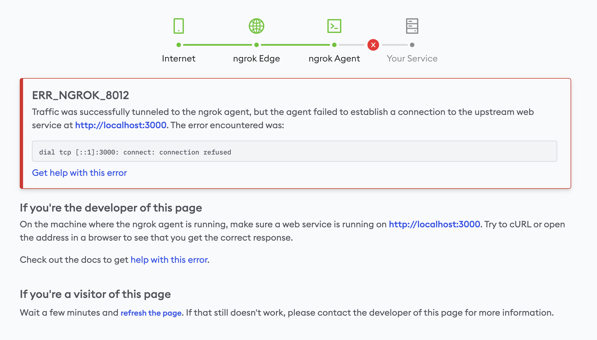

# ngrok - 로컬 서버를 외부에서 접근하고 싶을 때 사용하는 프로그램

## 개요

프로젝트를 진행하는 도중, 로컬 서버를 다른 기기나 다른 사용자가 접근해야 할 상황이 존재합니다.

이런 상황에 ngrok을 사용해 로컬 서버에 접근하게 할 수 있습니다.

## ngrok이란?

Ngrok은 로컬에서 실행 중인 웹 서버나 애플리케이션을 외부에서 접근할 수 있도록 안전한 공개 URL을 제공해주는 도구입니다. 주로 로컬 서버를 외부에 공유해야 할 때 매우 유용하게 쓰입니다.

## 언제 사용하나요?

구체적으로 다음과 같은 상황에서 유용합니다.

1. **로컬 개발 환경에서 테스트**

**API 테스트**: 로컬에서 API 서버를 만들었을 때, 외부의 클라이언트(예: 모바일 앱, 다른 개발자)가 테스트를 해야 할 경우 Ngrok을 사용하면 로컬 서버를 공개하여 API 호출을 쉽게 테스트할 수 있습니다.

**웹훅(Webhook) 테스트**: 외부 서비스(예: Stripe, GitHub, Slack 등)에서 발생한 이벤트에 따라 로컬 서버로 요청을 보내야 하는 경우 Ngrok을 사용하여 로컬 서버로 웹훅을 보낼 수 있습니다.

2. **팀원과 실시간 공유**

**UI/UX 피드백**: 로컬에서 작업한 웹사이트나 애플리케이션을 실시간으로 팀원이나 클라이언트에게 보여주고 피드백을 받을 때, Ngrok으로 URL을 생성하여 빠르게 공유할 수 있습니다.

**디버깅 및 협업**: 팀원들이 로컬에서 작업한 것을 바로 접근하고 디버깅할 수 있어 협업 시에 매우 유용합니다.

3. **시연 및 데모**

**프로젝트 발표**나 **제품 시연**에서 로컬 서버에서만 작동하는 애플리케이션을 외부에서도 쉽게 접근할 수 있게 할 때, Ngrok을 사용해 데모할 수 있습니다.

4. **외부 네트워크 접근 필요**

로컬 서버를 외부 네트워크나 VPN을 통해 접속해야 할 때도 Ngrok을 사용하면 간단하게 로컬 서버를 외부에 노출할 수 있습니다. 예를 들어, 특정 네트워크 환경에서만 테스트 가능한 경우 유용합니다.

5. **방화벽 및 NAT 우회**

로컬 개발 환경에서 외부 인터넷에서 접근할 수 없도록 막혀 있는 방화벽이나 NAT(Network Address Translation)를 우회하여 외부에서 접근할 수 있는 경우에 유용합니다.

## 사용 방법

0. [ngrok 공식 사이트](https://ngrok.com/)

1. 위 사이트로 접속해, 회원가입을 합니다.
2. Getting Started 탭을 선택해 하라는 대로 따라 설치한다.

   

3. macOS 의 경우, terminal을 실행한 뒤, brew로 설치한다.

   

   3-1. Homebrew 를 사용해 ngrok을 설치합니다. (Homebrew는 앱스토어처럼 프로그램을 명령어로 설치할 수 있는 시스템입니다.)

   ```bash
   brew install ngrok/ngrok/ngrok
   ```

   3-2. ngrok에 인증 토큰을 등록합니다.

   ```bash
   ngrok config add-authtoken 개별 인증 토큰
   ```

   3-3. 실행중인 로컬 서버의 포트를 아래 맨 뒤에 작성합니다. (http://localhost:8080일 경우)

   ```bash
   ngrok http http://localhost:8080
   ```

## **ERR_NGROK_8012 에러 발생 및 해결**

서버를 실행할 경우 아래와 같이 두 개의 URL이 생성되고, 둘 중 어느 링크를 눌러도 같은 결과로 출력됩니다.




하지만, `ngrok http [http://localhost:3000](http://localhost:3000/)` 으로 실행할 경우 아래와 같은 에러가 발생합니다.



해당 에러는 localhost에 대해 생각해보면 쉽게 이해할 수 있습니다.

운영체제는 hosts 파일에 localhost를 미리 정의해두어서, 해당 시스템 내의 IP주소를 할당합니다.

`localhost`는 기본적으로 **로컬 컴퓨터**에서만 접근 가능한 **루프백 주소**(`127.0.0.1`)를 가리킵니다. 이는 해당 컴퓨터에서만 인식되며, 외부 네트워크에서 `localhost`를 사용해 접근할 수 없습니다.

반면, **`192.168.0.20`** 같은 **로컬 IP 주소**는 **네트워크에 연결된 다른 장치**에서도 접근할 수 있는 주소입니다. 이 때문에 Ngrok이 `localhost` 대신 `192.168.x.x` 같은 실제 IP 주소를 사용할 때 더 안정적으로 동작할 수 있습니다.

    따라서, 다른 장치에서 접근하기 위해서는 ip주소를 사용해야 동작할 수 있습니다.

`ngrok http [http://](http://localhost:3000/)192.168.0.20:3000` 와 같은 방식으로 사용하면 됩니다.
