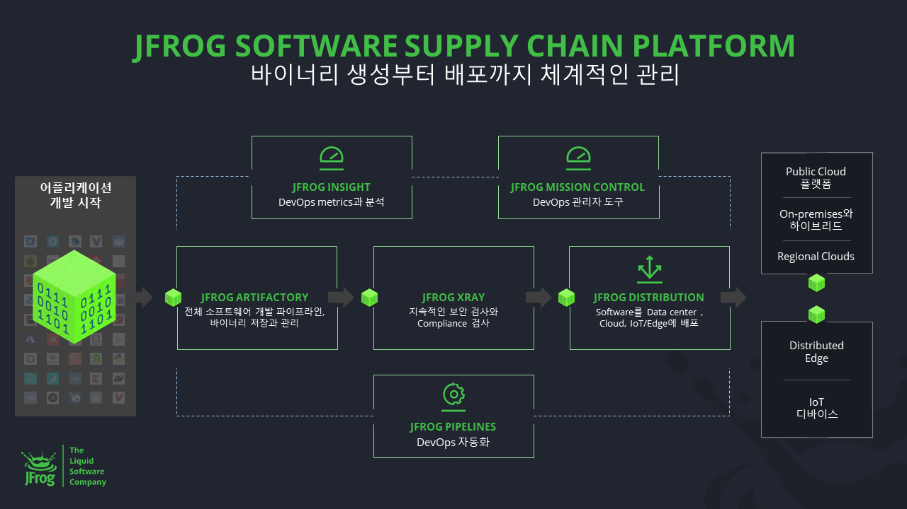

# Artifact

[Java] Maven등에서 빌드 결과로 나오는 개발 산출물
[Etc] 다양한 `Delivery 및 Deploy를 위해 최종적으로 관리되는 산출물`을 주로 아티팩트라고 명칭함.

ex) Docker Image, WAR, JAR, RPM Package

버전 관리가 필요하고, 필요시 여러 환경에 배포할 수 있다.

## Artifactory

Artifact를 모아서 저장하는 공간(중앙 저장소)을 `Library` 또는 `Artifactory`라고 함.

Maven, Gradle, npm, Docker등 여러 패키지 매니저와 호환할 수 있다.

**[가능한 기능]**

- 저장소 관리
- 배포
- 보안 및 접근 제어
- 메타데이터 관리

관련 기업 : Gitlab, JFrog

## JFrog Artifactory

각 OS 및 컨테이너를 구성하는 패키지 및 라이브러리 버전을 중앙에서 관리하도록 도와주는 솔루션
(관리 실무자가 퇴사시 관리에 문제 발생하는 것 방지)

이스라엘 출신 클라우드 SW기업인 JFROG에서 개발한 범용 artifact Repository.
리눅스/유닉스를 비롯해 도커/쿠버네티스에서 사용하는 `패키지/라이브러리/바이너리 파일 버전 중앙 관리 DevOps 솔루션`

**특징**

- 하이브리드 클라우드 환경에 적합
- REST API 제공

## 참고 자료

[JFROG ARTIFACTORY](https://jfrog.com/artifactory/)
[ATLASSIAN JFrog Product](https://confluence.curvc.com/display/ASD/JFrog+Product)
