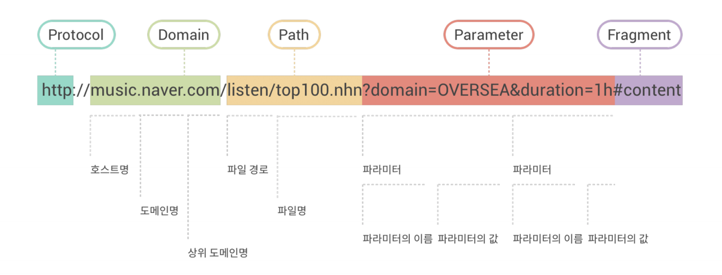

### HTTP의 특징

1. 클라이언트-서버 구조
2. 무상태 프로토콜
3. 비연결

# REST API (REpresentational State Transfer)

URI는 정보의 자원만 표현, 자원의 행위는 HTTP Method에 명시

## 자원(Resource)의 식별

### URI Uniform Resource Identifier (통합 자원 식별자)

인터넷에서 리소스를 식별해주는 문자열 → 가장 일반적인 URI는 URL

### URL Uniform Resource Locator (통합 자원 위치)

Web에서 주어진 리소스의 주소 → 네트워크 상에 리소스의 위치 알려주기 위한 약속



1. Scheme = Protocol
- 브라우저가 리소스를 요청하는 데 사용해야 하는 규약
- URL의 첫 부분은 브라우저가 어떤 규약을 사용하는지 나타냄
- 기본적으로 웹은 HTTP(s)요구. 메일 열기 위한 mailto:, 파일전송위한 ftp 등 다양함
2. Domain Name
- 요청 중인 웹 서버
- 어떤 웹 서버가 요구되는지 가리키며 직접 IP주소 사용하는 것도 가능하지만, 사람이 외우기 어렵기 때문에 주로 이름 사용
3. Port
- 웹 서버의 리소스에 접근하는데 사용되는 기술적인 문(GATE)
- HTTP 프로토콜 표준 포트
  HTTP 80, HTTPS 443 (표준포트만 생략 가능)
4. Path to the file
- 웹 서버의 리소스 경로
초기에는 실제 파일의 물리적 위치, but 오늘날은 추상화된 형태의 구조
5. Parameters
- 웹 서버에 제공하는 추가적인 데이터
- & 기호로 구분되는 key-value 쌍 목록
- 서버는 리소스 응답 전에 파라미터 사용해서 추가 작업 수행 가능
6. Anchor
- 일종의 북마크, 브라우저의 특정 지점의 콘텐츠 표시
    - fragment identifier 부분식별자 → 서버에 전송되지 않음, 브라우저에게 해당지점으로 이동할 수 있도록 함.

## 자원의 행위 (Verb)

### HTTP Request Methods

리소스에 대한 행위 정의 → HTTP verbs

1. GET
- 서버에 리소스의 표현을 요청
- GET을 사용하는 요청은 데이터만 검색해야 함
2. POST
- 데이터를 지정된 리소스에 제출
- 서버의 상태 변경
3. PUT
- 요청한 주소의 리소스 수정(전체수정)
4. PATCH
    
    - 요청한 주소의 리소스 수정(일부수정)
    
5. DELETE
- 지정된 리소스 삭제
6. HEAD
    
    단순히 서버의 리소스에 대한 메타데이터를 반환
    
    주어진 URL에서 리소스와 연관된 모든 헤더를 반환하지만 실제로 리소스를 반환하지는 않음
    
    ```json
    HTTP/1.1 200 OK 
    날짜: 2024년 8월 12일 월요일 12:00:00 GMT 
    콘텐츠 유형: text/html 
    콘텐츠 길이: 1234 
    최종 수정: 2023년 8월 18일 목요일 15:30:00 GMT
    ```
    
7. OPTIONS
    
    지원되고 허용되는 HTTP 메서드 목록을 반환 (GET, PATCH 등)
    
8. TRACE
    
    진단, 디버깅 및 문제 해결에 사용
    
    요청-응답 주기의 데이터를 기록하는 진단 추적을 반환
    
    추적 내용은 대개 클라이언트가 보낸 다양한 요청 헤더에 대한 서버의 에코일 뿐
    
9. CONNECT
    
    서버 측 리소스와의 연결을 만드는 데 사용
    
    가장 일반적인 대상은 프록시 서버이며, 클라이언트는 로컬 네트워크에서 터널링하기 위해 액세스
    
    RESTful API 설계자는 CONNECT HTTP 요청 메서드와 상호 작용하는 경우가 거의 없음
    

이 외에도 아래와 같은 메서드들이 있다.

- BIND.
- CHECKOUT.
- MKCALENDAR.
- ORDERPATCH.
- PRI.
- PROPFIND.
- SEARCH.
- UNLINK.
- UPDATE.

### HTTP response status codes

특정 HTTP요청이 성공적으로 완료되었는지 여부 나타냄

https://developer.mozilla.org/en-US/docs/Web/HTTP/Status

- Informational responses (100 - 199)
- Successful responses (200 - 299)
- Redirection messages (300 - 499)
- Client error responses (400 - 499)
- Server error responses (500 - 599)

## 자원의 표현 (Representation of Resource)

REST API → JSON응답 권장 → Django는 템플릿 역할 담당하지 않아 Front-end, Back-end 분리됨

## REST의 특징

1. **Server - Client 구조**
    - Server : API 제공, 비즈니스 로직 처리 및 저장
    - Client : 사용자 인증이나 context(세션, 로그인 정보 등) 직접 관리 책임
2. **Stateless**
    
    HTTP Protocol : Stateless ⇒ API : Stateless
    
    - 세션, 쿠키 등을 신경쓰지 않아도 되어서 구현이 단순해짐
    - 각 API는 요청만을 단순 처리하여 서버 처리방식의 일관성이 부여되고 서비스 자유도가 높아짐
3. **Cacheable**
    
    웹 표준 HTTP Protocol을 사용하여 웹의 인프라 그대로 사용 가능함 
    
    → HTTP의 특징 중 하나인 캐싱 기능 적용 가능 (Last-Modified Tag, E-Tag 활용)
    
    → 대량의 요청 효율적 처리 가능
    
4. **Layered System**
    
    클라이언트는 REST API Server만 호출
    
    REST Server는 다중 계층으로 구성될 수 있음
    
    - 보안, 로드 밸런싱, 암호화 등을 위한 계층을 추가하여 구조를 변경할 수 있습니다.
    - Proxy, Gateway와 같은 네트워크 기반의 중간매체를 사용할 수 있습니다.
    - Client는 Server와 직접 통신하는지, 중간 서버와 통신하는지는 알 수 없습니다.
5. **Uniform Interface**
    
    URI로 지정한 자원에 대한 요청을 통일되고 한정적으로 수행하는 아키텍처 스타일
    
    HTTP 표준 프로토콜 따르는 모든 플랫폼에서 사용 가능함 (기술이나 언어에 종속되지 않음)
    
6. **Self-Descriptiveness**
    
    요청 메세지만 보고도 쉽게 이해할 수 있음
    

# DRF

### Django REST framework

Django에서 Restful API 서버 쉽게 구축할 수 있도록 도와주는 오픈소스 라이브러리

### Serialization 직렬화

여러 시스템에서 활용하기 위해 데이터 구조나 객체 상태를 나중에 재구성할 수 있는 포맷으로 변환하는 과정 → 어떠한 언어나 환경에서 나중에 다시 쉽게 사용할 수 있는 포맷으로 변환하는 과정

## DRF with Single Model

- Postman 설치
API 구축하고 사용하기 위한 플랫폼
API 빠르게 만들 수 있는 여러 도구 및 기능 제공

## DRF with Multiple Models

```bash
pip install django-rest-multiple-models
```

```python
INSTALLED_APPS = (
    ....
    'drf_multiple_model',
)
```

```python
from drf_multiple_model.views import ObjectMultipleModelAPIView
```

# REST vs RESTful API

- RESTful API : REST 설계 규칙을 잘 지켜서 설계된 API